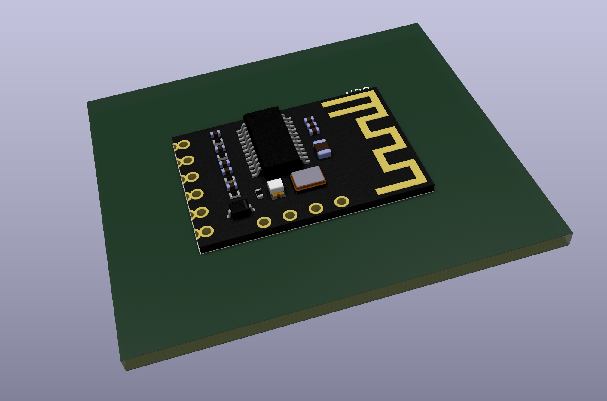

M18 bluetooth module
====================

Usage
-----

To include in your kicad library just add it as a git submodule:

    git submodule add https://github.com/besi/kicad-m18 lib/m18

Credits
-------
3d model file provided by [Phat Vu](https://grabcad.com/phat.vu-6)
